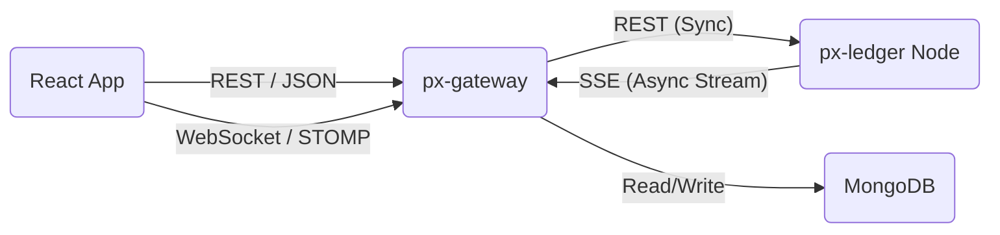

# Pnyx Gateway (`px-gateway`)

A secure Spring Boot API Gateway and Authentication server for the Pnyx cryptocurrency ecosystem. This service acts as the middleware between the frontend client and the blockchain ledger node (`px-ledger`).

It handles user identity, manages secure sessions via JWT/Refresh Tokens, and bridges real-time blockchain events to the user interface.

---

## 🚀 Key Features

* **Secure Authentication:**
* Stateless JWT authentication (10-minute access tokens).
* Secure Refresh Token rotation flow (7-day duration, stored in DB).
* BCrypt password hashing.


* **Reactive Event Bridge:**
* **Ingest:** Consumes Server-Sent Events (SSE) from the Ledger Node using `WebClient`.
* **Broadcast:** Pushes real-time updates (e.g., "Transaction Received") to the frontend via **WebSockets (STOMP)**.


* **Resilient Proxying:**
* Proxies wallet and transaction requests to the Ledger Node.
* Includes automatic retry logic for stream connections.


* **Robust Error Handling:**
* Global Exception Handling with standardized JSON error responses.
* Specific handling for `401 Unauthorized` and `403 Forbidden`.


---

## 🛠️ Tech Stack

* **Core:** Java 17+, Spring Boot 3.x
* **Database:** MongoDB (User data & Refresh Tokens)
* **Security:** Spring Security, JJWT (Java JWT)
* **Reactive/Async:** Spring WebFlux (WebClient), Spring WebSocket (STOMP)
* **Testing:** JUnit 5, Mockito, MockMvc, Reactor Test (`StepVerifier`)
* **Build Tool:** Maven

---

## 🏗️ Architecture

The Gateway sits in the middle of the stack:



### The Real-Time Event Flow

1. **Subscribe:** On startup, `BlockEventProcessor` connects to the Ledger Node's SSE endpoint (`/v1/api/events/subscribe`).
2. **Listen:** It listens for `BLOCK_MINED` events.
3. **Process:** When a block is found, it fetches the block details and checks for transactions involving local users.
4. **Push:** If a user is affected, a message is pushed to their specific WebSocket topic (`/topic/wallets/{walletId}`).

---

## ⚙️ Configuration

Create an `application.properties` file in `src/main/resources`.

```properties
# Server Configuration
server.port=8080

# MongoDB Configuration
spring.data.mongodb.uri=mongodb://localhost:27017/pnyx_gateway

# Ledger Node Connection
px-ledger.url=http://localhost:8081
# Listener Control (Set to false during integration tests)
px-gateway.listener.enabled=true

# JWT Security Configuration
jwt.secret=YOUR_SUPER_SECRET_KEY_MUST_BE_LONG_ENOUGH
# Access Token: 10 minutes (600000 ms)
jwt.expiration=600000
# Refresh Token: 7 days (604800000 ms)
jwt.refreshExpiration=604800000

```

---

## 🔌 API Endpoints

### Authentication (`/api/auth`)

| Method | Endpoint | Description | Auth Required |
| --- | --- | --- | --- |
| `POST` | `/register` | Register a new user account | No |
| `POST` | `/login` | Login to receive Access & Refresh tokens | No |
| `POST` | `/refresh` | Exchange a valid Refresh Token for a new Access Token | No |

### Real-Time (WebSockets)

* **Endpoint:** `/ws` (SockJS enabled)
* **Protocol:** STOMP
* **Subscription Topic:** `/topic/wallets/{walletId}`

---

## 🧪 Testing

This project achieves high code coverage using **JUnit 5** and **Mockito**. It includes specialized tests for the reactive streams and JWT logic.

### Running Tests

To run the full suite (including the fix for the infinite stream loop in tests):

```bash
mvn clean test

```

### Key Test Classes

* `AuthControllerTest`: Covers Login, Registration, and Refresh Token flows.
* `LedgerClientServiceTest`: Mocks `WebClient` to verify SSE stream consumption.
* `BlockEventProcessorTest`: Verifies the logic pipeline (Stream -> DB Lookup -> WebSocket Push).

---

## ▶️ Running the Application

1. **Start MongoDB:** Ensure your MongoDB instance is running.
2. **Start Ledger Node:** Ensure `px-ledger` is running on port `8081` (or update `application.properties`).
3. **Run Gateway:**

```bash
mvn spring-boot:run

```

The API will be available at `http://localhost:8080`.
